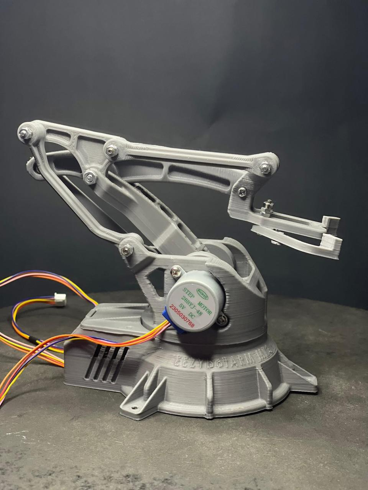
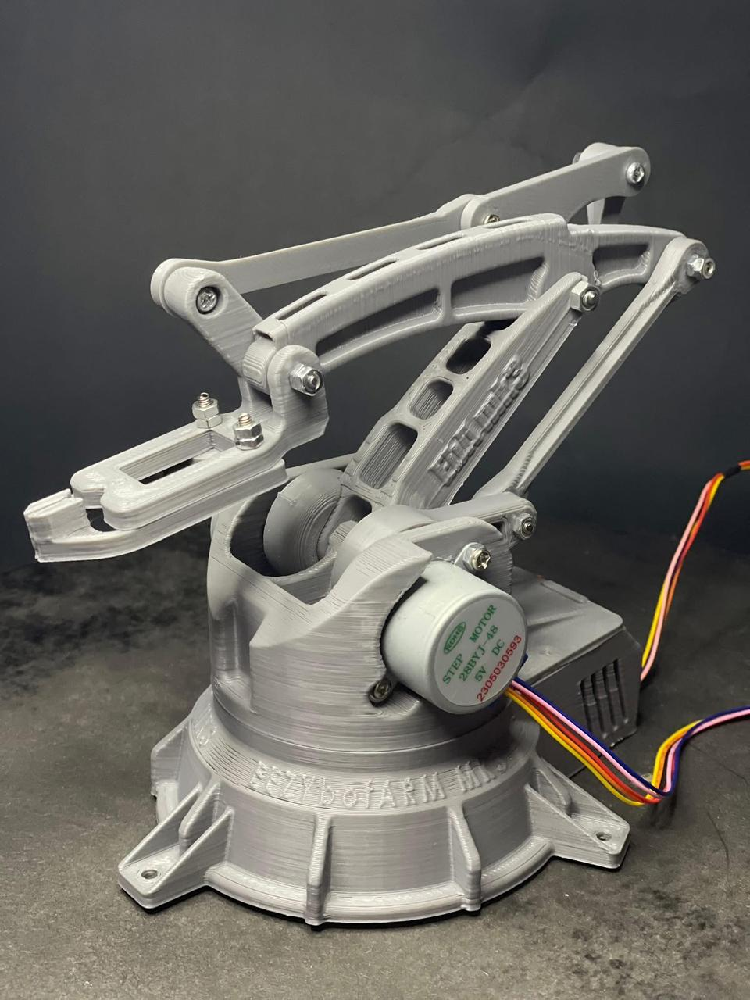
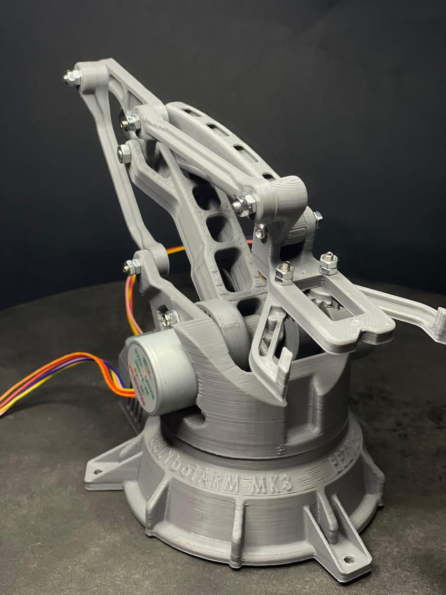
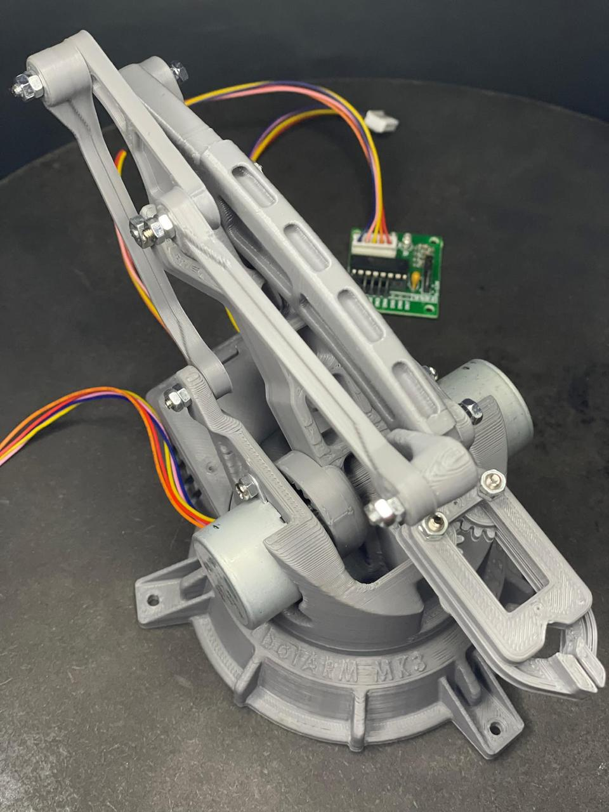
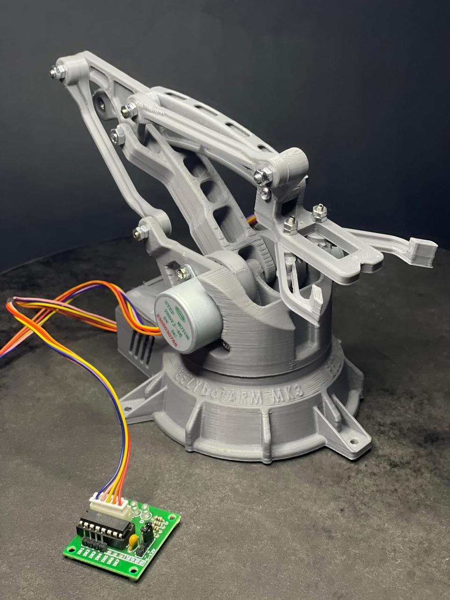
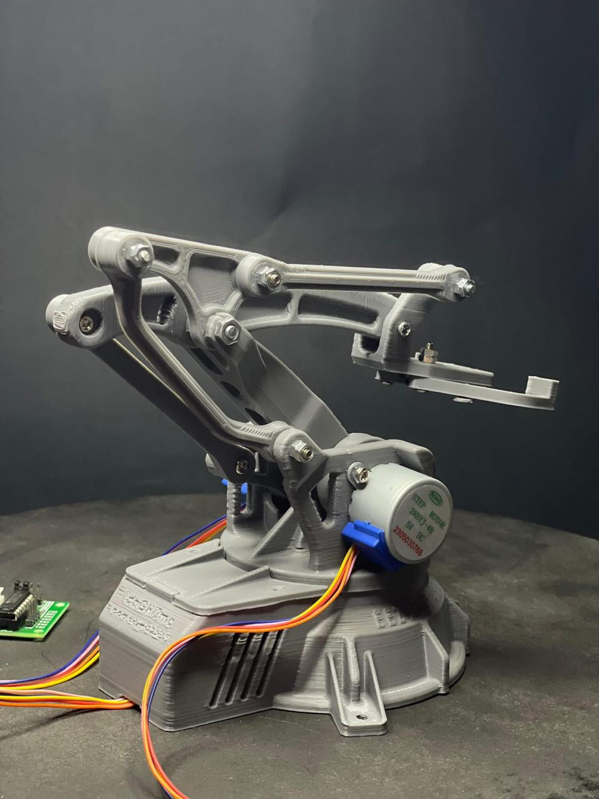
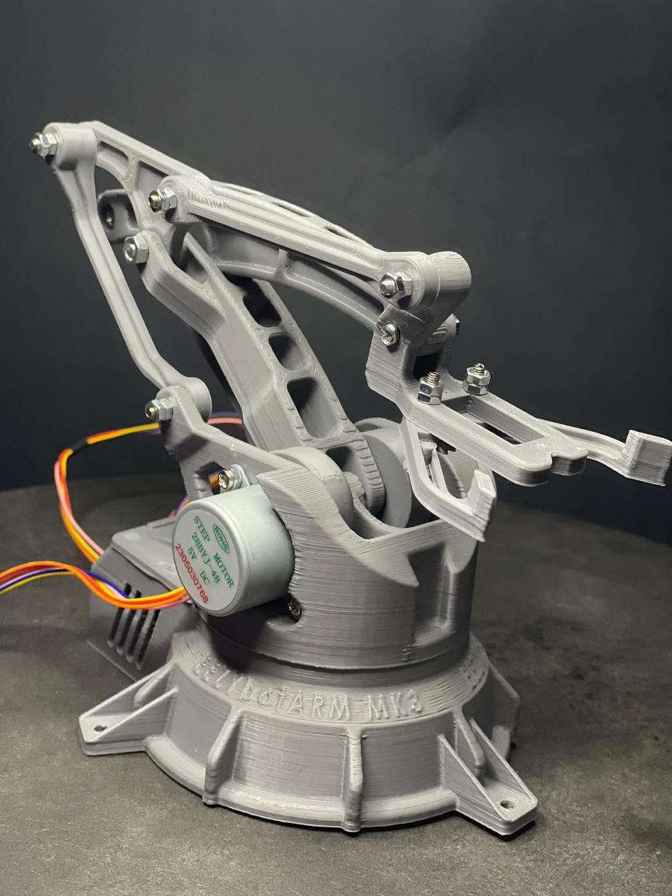

# 🤖 Joystick-Controlled Robotic Arm

This project demonstrates how to build and control a robotic arm using a joystick and Arduino.  
The arm moves in X and Y directions using stepper motors, and has a gripper controlled by a servo motor.

---

## 🔧 Features

- Two-axis movement (X, Y) using joystick input  
- Gripper opens/closes using joystick button  
- Manual control system with smooth motion  
- Built with Arduino Uno, SG90 servo, and ULN2003 drivers  

---

## 🎮 Components Used

- Arduino Uno  
- 2x 28BYJ-48 Stepper Motors  
- 2x ULN2003 Driver Boards  
- SG90 Mini Servo Motor  
- Joystick Module  
- Breadboard + Wires  
- Power Supply (Batteries)  

---

## 💻 Code

See the [`arm_robot.ino`](arm_robot.ino) file for full implementation.

---

## 📦 How to Run

1. Open the code in Arduino IDE  
2. Upload to Arduino Uno  
3. Connect the components as per your circuit diagram  
4. Move the joystick to control the arm and gripper

---

## 👩‍💻 Team

- Mirna Elbolaky  
- Mennatullah Azab  
- Mariam Abo Slema  
- Alaa Abo Slema  
- Nada Samir Sadek  
- NourAllah Shaheen  

**Supervised by:** Dr. Emad Elsayed

---

## 📸 Project Photos

Here are some real shots of the robotic arm:

  
  
  
  
  
  
  

---

## 📚 License

This project is for academic and educational purposes.
